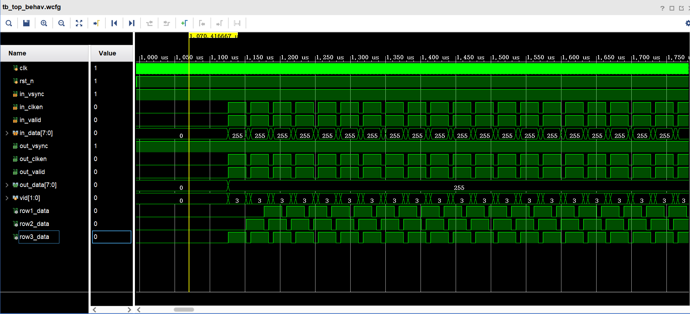
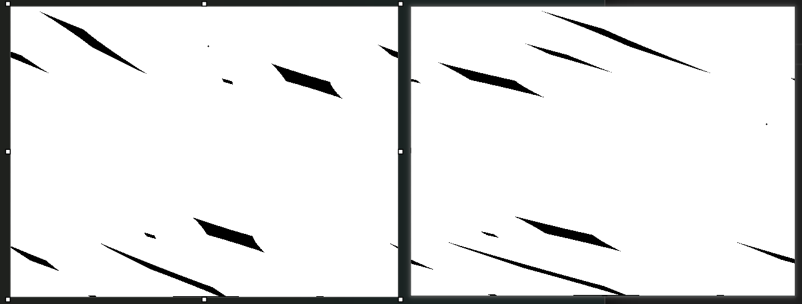

debug过程记录  测试1
## 二值化仿真输出时序（无图像输出）

## 灰度输出仿真时序

主要区别在于二值化的j信号没有与index信号一致

## 8位像素膨胀时序图

## 1位二值化膨胀时序图

## 1bit像素处理膨胀（左），8bit像素处理膨胀（右）

## 开运算（阈值30，左），开运算（阈值80，右）

图像仿真技巧，由于我写的仿真测试平台只能进行图片仿真，但上板测试时是对视频流处理，当我利用仿真验证算法最后的控制号同步是否正确会涉及到一个问题：图像算法中最后一个模块的制信号延时即使不对也不会影响仿真结果。因为最后的同步操作为了下一步图像处理而做，但是对于仿真来说，最后的图像算法完之后就没了。所以为了测试同步信号是否正确需要在最后的算后面再添加一级。
这一级最好放在tb里实现（好像大磊的tb里已经做了相关工作）